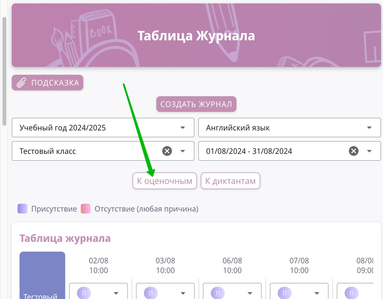
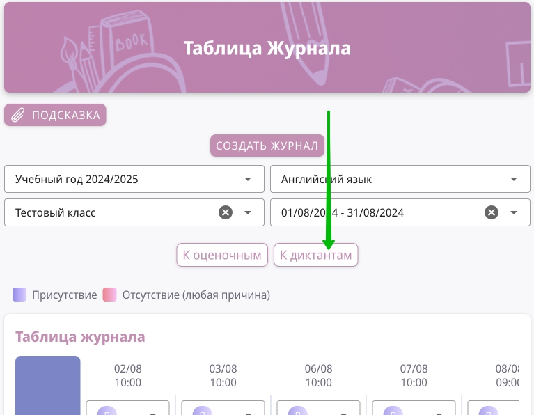
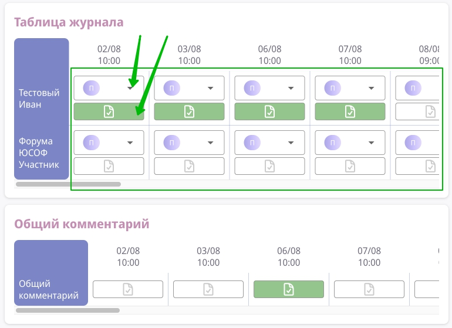
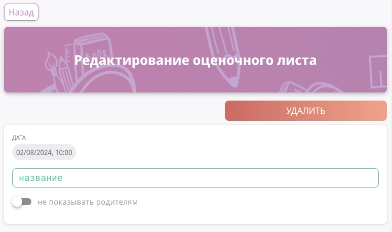
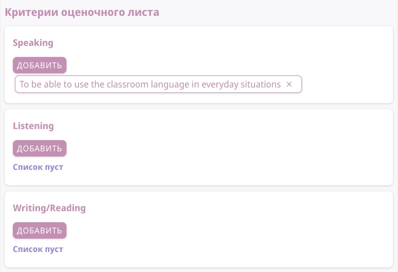
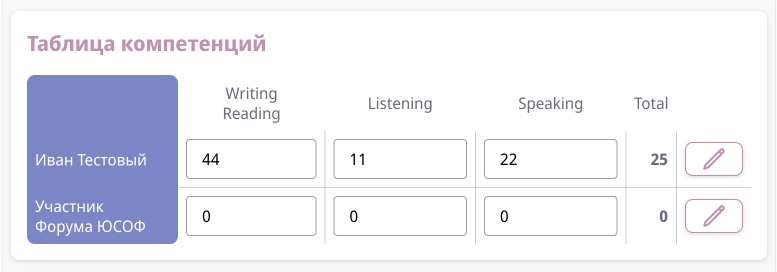
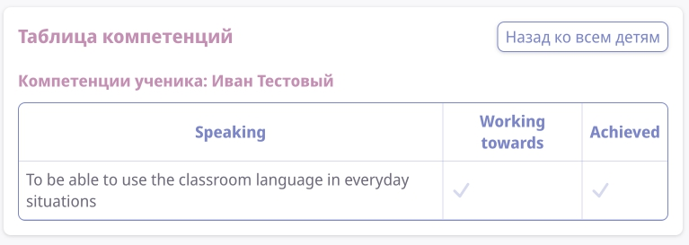

# Журнал учителя

## Как открыть журнал (2 варианта)

**1 вариант:**

1. Перейдите на [таблицу Журнала](https://new-school.geekbase.ru/teacher-journal/table)

2. Заполните поля **ГОД**, **ПРЕДМЕТ**, **КЛАСС**

> После заполнения этих полей в поле **ПЕРИОД** подтянутся доступные периоды!

3. Выберите один из периодов в поле **ПЕРИОД** 

**2 вариант:**

1. Перейдите в [список Журналов](https://new-school.geekbase.ru/subjects-journals)

2. Нажмите на нужный Журнал

## Создание Оценочного

1. Откройте Таблицу журнала 

2. Нажмите на кнопку **К ОЦЕНОЧНЫМ**

3. Нажмите на день из списка 

> Появится кнопка **СОЗДАТЬ ОЦЕНОЧНЫЙ**

3. Нажмите на **СОЗДАТЬ ОЦЕНОЧНЫЙ**

4. Заполните все поля и Сохраните

> **ОЦЕНОЧНЫЙ ЛИСТ** появится в списке 

## Создание Диктанта

1. Откройте Журнал [как открыть журнал](#как-открыть-журнал-2-варианта)

2. Нажмите на кнопку **К ДИКТАНТАМ**

3. Нажмите на день из списка 

> Появится кнопка **СОЗДАТЬ ДИКТАНТ**

3. Нажмите на **СОЗДАТЬ ДИКТАНТ**

4. Заполните все поля и Сохраните

> **ДИКТАНТ** появится в списке 

## Добавление Коммантария и Статуса посещения

1. Откройте Журнал [как открыть журнал](#как-открыть-журнал-2-варианта)

2. В таблице журнала вы увидите 2 кнопки в ячейке у каждого ученика:

- Статус посещения
- Комментарий

3. Так же есть таблица Общий комментарий (сразу под Таблицей Журнала)

> Введите нужные данные - они сохранятся АВТОМАТИЧЕСКИ

## Заполнение оценочных

На странице редактирования **ОЦЕНОЧНОГО ЛИСТА** вы можете изменить:
- Название
- Видимость для родителей и учеников

Для английского языка:
- Добавление Критериев

- Заполнение таблицы Компетенций

- Заполнение компетенций для конкретного ученика
>Чтобы перейти в эту таблицу нужно нажать на "карандашик" в Таблице компетенций у нужного ученика

